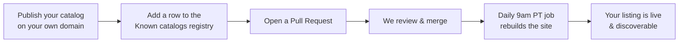

# Register a service

Want other agents to discover **your** agentic services — agents (A2A), MCP
servers, or skills? Search 4 Agents is a **federated registry**: you stay the
source of truth by hosting your own catalog, and we keep a public **list of
known catalogs** that points at yours.

Listing is a simple, reviewable **pull request**. This page is the plan.

## The plan at a glance



## Before you start: publish your own catalog

You register a **link to your catalog**, not your raw services — so first make
sure your catalog is reachable:

1. **Write an `ai-catalog.json`** describing your services. See the
   [Catalog](catalog.md) page for the anatomy of an entry and full examples.
2. **Host it at the well-known path over HTTPS:**
   `https://yourdomain.com/.well-known/ai-catalog.json` (this is the
   *Discoverable* conformance level).
3. **Verify it loads** — the same way an agent would:

    ```bash
    curl -fsSL https://yourdomain.com/.well-known/ai-catalog.json | jq .
    ```

!!! tip "No domain? Use GitHub Pages"

    You can host your catalog for free on GitHub Pages — exactly like this site
    does. Put `ai-catalog.json` under `/.well-known/` and serve it at
    `https://<you>.github.io/.well-known/ai-catalog.json`.

## Step-by-step: get listed

1. **Fork** the repository:
   [`Search4Agents/Search4Agents.github.io`](https://github.com/Search4Agents/Search4Agents.github.io).
2. **Edit [`docs/registry.md`](registry.md)** and add **one row** to the
   *Known catalogs* table with:
    - **Name** — the display name of your project/org.
    - **GitHub repository** — a link to the repo that hosts/backs your catalog.
    - **Catalog URL** — your live `https://…/.well-known/ai-catalog.json`.
    - **Kinds** — what you publish (`agents`, `mcp`, `skills`).
    - **Notes** — a one-line description.
3. **Commit** on a branch and **open a Pull Request** against `main`. Use a
   title like `registry: add <Your Name>`.
4. **Pass the checklist** below in your PR description.
5. A maintainer reviews and **merges**. The
   [daily rebuild](#how-listings-go-live) publishes your listing.

[Fork & open a Pull Request :material-source-pull:](https://github.com/Search4Agents/Search4Agents.github.io/fork){ .md-button .md-button--primary }

## Acceptance checklist

Copy this into your PR description and tick each box:

- [ ] My catalog is served over **HTTPS** at the **well-known path**
      (`/.well-known/ai-catalog.json`).
- [ ] The JSON is **valid** and includes `specVersion` and an `entries` array.
- [ ] Each entry has a stable `identifier`, a `displayName`, a `mediaType`, and a
      `url` (or inline `data`).
- [ ] My **GitHub repository** link works and is public.
- [ ] I added exactly **one row** to `docs/registry.md`, kept alphabetical order,
      and didn't modify other rows.
- [ ] My services are lawful, safe, and not spam.

!!! note "What we don't do"

    We don't host or proxy your services, and we don't take ownership of them.
    The registry is a **pointer** to catalogs you control — you can update or
    remove your entry at any time with another PR.

## How listings go live

Merging your PR updates the source, and a **scheduled GitHub Actions job rebuilds
and redeploys the site every morning at 9:00 a.m. America/Los_Angeles** (in
addition to deploying immediately on every push to `main`). So even
documentation-only or registry-only merges are guaranteed to be live within a
day. See `.github/workflows/docs.yml`.

## Updating or removing your entry

Open another pull request that edits or deletes your row in
[`docs/registry.md`](registry.md). Same flow, same checklist.
